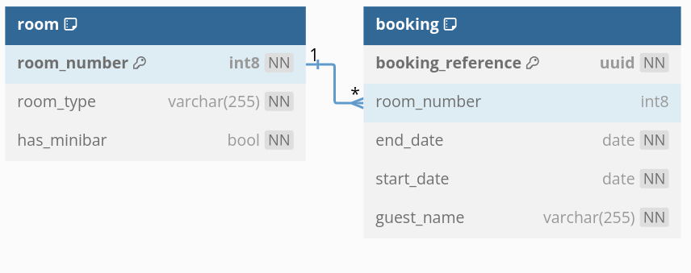

# hotelmanager-exxeta-backend

Backend-Repository für den Hotelmanager der Exxeta Challenge

## Run the application

`./gradlew bootRun`

### Providing a database connection

The application requires a running PostgreSQL instance.
You can start one using [Docker](https://hub.docker.com/_/postgres/):

```
docker pull postgres
docker run --name <NAME> -p 5432:5432 -e POSTGRES_DB=hotelmanager -e POSTGRES_PASSWORD=<PASSWORD> postgres
```
The `<PASSWORD>` needs to match the one given in [the application properties](./src/main/resources/application.properties).

## Design
### Database Schema
The DB schema is defined in [Entities.kt](./src/main/kotlin/com/exxeta/hotelmanager/Entities.kt).
We have two entities "Room" and "Booking", where one room may have many bookings, and bookings belong to exactly one room.
These two entities are translated to tables in the PostgreSQL database.

